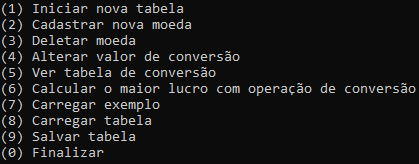
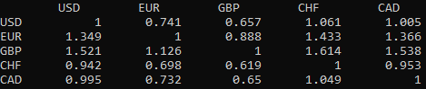
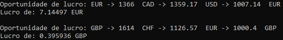

# Arbitragem financeira

**Número da Lista**: 6<br>
**Conteúdo da Disciplina**: Final<br>

## Alunos
| Matrícula | Aluno |
| -- | -- |
| 18/0114077 | Lucas Rodrigues Fonseca |
| 18/0113861 | Kleidson Alves Corrêa |

## Sobre 
O projeto utiliza o algoritmo de Bellman-Ford para procurar oportunidades de lucro em um determinado conjunto de valores de conversão entre moedas construído com uma matriz de adjacência. Esse processo é conhecido como arbitragem financeira. Essas oportunidades consistem em, iniciando com um dado valor de uma determinada moeda, e fazendo certas sequências de conversões de uma moeda para outra, retornar à moeda inicial com um valor maior do que foi iniciado. Isso pode ser alcançado multiplicando o log de cada valor de conversão por -1 e em seguida procurando por ciclos negativos no grafo.

## Screenshots
| Menu | Tabela de conversões | Oportunidades de lucro |
| :-: | :-: | :-: |
|  |  |  |

## Instalação 
**Linguagem**: C++<br>

### Como instalar as dependências
```
sudo apt install git
sudo apt install make
sudo apt install g++
```

### Como executar
```
git clone https://github.com/projeto-de-algoritmos/Final_Arbitragem
cd Final_Arbitragem
make
make run
```

## Uso 
- **Iniciar nova tabela:** Permite que seja escolhida a quantidade de moedas, a sigla de cada uma delas e os valores de conversão de uma moeda para outra. O valor de conversão inverso é calculado automaticamente.
- **Cadastrar nova moeda:** Permite incluir uma nova moeda na lista de moedas já existente e definir o valor de conversão dela para cada uma das outras moedas.
- **Deletar moeda:** Permite deletar uma moeda da lista de moedas já existente.
- **Alterar valor de conversão:** Permite que sejam escolhidas duas moedas e um valor para que seja alterado o valor de conversão de uma para a outra.
- **Ver tabela de conversão:** Mostra todos os valores de conversão atualmente em uso.
- **Computar oportunidades de lucro:** Encontra oportunidades de lucro e em seguida lista essas oportunidades.
- **Carregar exemplo:** Carrega um exemplo pré-definido de dados de conversão.
- **Carregar tabela:** Pede o nome de um arquivo salvo na pasta data que tem os dados de conversão salvos e carrega os dados para o programa. Não deve ser incluído o ".txt".
- **Salvar tabela:** Salva os dados de conversão que estão em uso no momento em um arquivo de texto para que possa ser carregado depois. Não deve ser incluído o ".txt"

## Outros 
- O vídeo explicativo está na pasta raíz do projeto. (A descrição da opção 6 do menu foi alterada após o vídeo)
- Motivação: http://www.dt.fee.unicamp.br/~ricfow/IA881/caminhoMinimo.pdf
